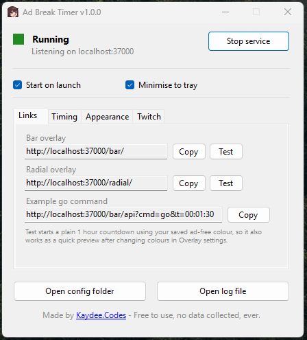
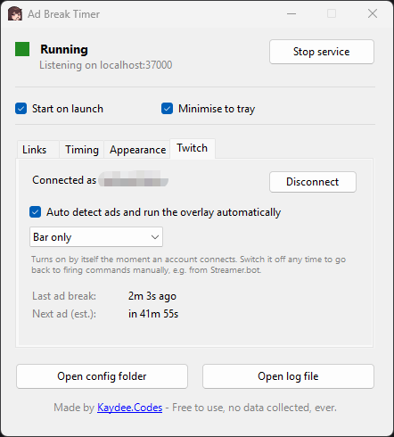
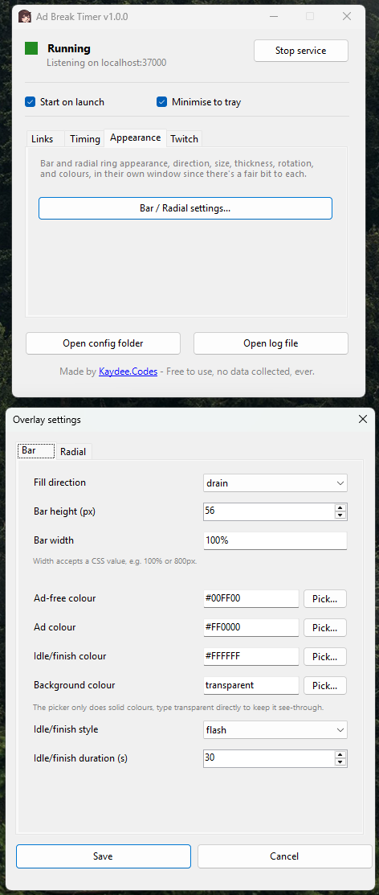
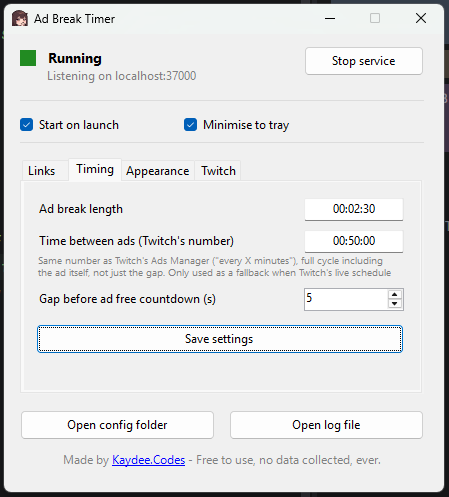

# Ad Break Timer


A small Windows app that shows an ad break countdown on your OBS stream, connects directly to your Twitch account, and runs itself, no manual triggering, no Streamer.bot required. It watches for real ad breaks as they happen and switches your overlay between "ad running" and "ad free" automatically.

Made by [Kaydee.Codes](https://kaydee.codes/). Free to use, no data collected, ever.

---

## Download

**[Download v1.0.2 here](https://github.com/KaydeeCodes/AdBreakTimerGUI/releases/tag/v1.0.2)**

Extract the zip, double click `AdBreakTimerGUI.exe`, that's it, nothing else to install. No installer wizard yet, so for now it's a folder you can put anywhere and run.

*(Rather build it yourself from source instead? See [Building from source](#building-from-source) further down.)*

---

## Setting it up

Five steps, most of which you only ever do once.

### 1. Add the overlay to OBS

The app starts its overlay service automatically. On the **Links** tab, copy the **Bar overlay** or **Radial overlay** link and add it as a **Browser Source** in OBS. If you can't see anything yet because nothing's counting down, click **Test** next to it, that starts a plain 1 hour countdown in your saved colours, just so you've got something to position and resize.



### 2. Connect your Twitch account

Go to the **Twitch** tab and click **Connect**. A short code will appear and your browser will open on its own to Twitch's approval page, log in and approve it there. That's the whole flow, no passwords typed into this app, ever.

The moment it connects, **Auto detect ads** switches on by itself. From here, the app is genuinely hands-off: it watches for real ad breaks on your channel and drives the overlay itself, correcting itself automatically if Twitch's schedule changes (a snooze, a manually run ad, anything), even if the app's only just been opened or restarted mid-stream.



### 3. (Optional) Choose which overlay auto detect drives

If you're only using the bar, or only the ring, pick that from the dropdown under the checkbox, so the other one doesn't quietly run in the background for no reason.

### 4. (Optional) Adjust how the overlay looks

Click **Bar / Radial settings...** on the **Appearance** tab. Four colours are configurable independently: the colour while ads are running, the colour between ads, a colour briefly shown when either one finishes, and the background. Direction, size, thickness, and (for the ring) rotation are all here too. Pick colours visually with the built in colour picker, no need to know a hex code.



### 5. (Optional) Timing fallback

The **Timing** tab's numbers are mostly a safety net, not the main driver, since step 2 makes the app follow Twitch's real, live schedule instead. Worth knowing what's there anyway:



- **Ad break length**: only used to build the example command on the Links tab for manual/Streamer.bot use (see further down).
- **Time between ads (Twitch's number)**: the same number shown in Twitch's own Ads Manager ("run a 3 minute ad break every X minutes"). Only used if the app genuinely can't reach Twitch's live schedule for a moment, it's a fallback, not the primary source of truth once you're connected.
- **Gap before ad free countdown**: a short pause after an ad finishes before the next countdown starts, purely so the finish colour is actually visible for a moment.

**That's the whole setup.** Once step 2 is done, you shouldn't need to touch this again, it just runs.

---

## Everything below this is the technical reference

The stuff above is genuinely all you need day to day. Everything from here down is for anyone who wants to know how it works underneath, use it without Twitch, build it themselves, or is troubleshooting something.

### Building from source

Only needed if you'd rather build it yourself instead of using the download above.

**Dependency:** the [.NET 10 SDK](https://dotnet.microsoft.com/download) (Windows). This is a one-time install that lets your PC build and run C# apps like this one. Not needed if you're just using the downloaded release, that exe already has everything bundled in.

**Running it:**
1. Download this project (green **Code** button on this page → **Download ZIP**, then extract it).
2. Open a terminal in that extracted folder (in File Explorer, type `cmd` into the address bar and press Enter).
3. Run:
   ```
   dotnet run
   ```
   First run takes a minute or two while it downloads what it needs, after that the app's window just appears. Keep that terminal window open, closing it closes the app too.

**Building your own standalone exe** (same as the download above, just built by you):
```bash
dotnet publish -c Release
```
Produces a single, self-contained `AdBreakTimerGUI.exe` under `bin\Release\net10.0-windows\win-x64\publish\`, nothing else needs to travel with it.

### Using it without a Twitch connection (Streamer.bot / manual control)

You don't have to connect Twitch at all. Every overlay is driven by a plain HTTP API, `cmd=go` starts a countdown, `cmd=pause`/`cmd=stop`/etc. control it, so you can trigger everything by hand from Streamer.bot or any tool that can fire a web request. The trade-off is honest: without a Twitch connection, the app has no way to know about snoozes or manually run ads ahead of time, it only knows what you tell it.

Base: `http://localhost:<port>/bar/api` or `/radial/api` (port shown on the main window).

The main command:
```
cmd=go&t=01:00:00&color=%2300ff00&finish=%23ff0000&dir=drain
```

Other general commands: `start`, `pause`, `stop`, `reset`, `settime`, `addtime`, `subtime`, `setcolor`, `setadcolor`, `setfinishcolor`, `setbgcolor`, `setfinishstyle` (`flash`/`static`/`hidden`), `setflashduration`, `status`.

Bar only: `setdirection` (`drain`/`fill`), `setbarheight`, `setbarwidth`.

Radial only: `setdirection` (`cw`/`ccw`), `setsize`, `setthickness`, `settrackcolor`, `setrotation` (`0`/`90`/`180`/`270`).

Every request returns JSON, `{"ok": true, ...}` or `{"ok": false, "error": "..."}`.

### What Twitch permissions does this actually ask for, and why

Two scopes, both read/manage your own channel's ad data, nothing else:

- `channel:read:ads`: lets the app see when an ad break starts and read your channel's ad schedule (the same data Twitch's own dashboard timer uses).
- `channel:manage:ads`: needed for the ad schedule endpoint the app polls to stay accurate.

The app never reads chat, followers, subscriptions, or anything unrelated to ads. Your access token is encrypted on disk with Windows' own DPAPI, tied to your Windows account, and never leaves your machine except to talk directly to Twitch's servers. You can revoke access any time from your [Twitch connected accounts settings](https://www.twitch.tv/settings/connections), the app checks hourly and will prompt you to reconnect if it notices.

### How the automatic side actually works

- A live WebSocket connection to Twitch's EventSub service reacts the instant a real ad break starts.
- A background check polls Twitch's own ad schedule every 30 seconds (and once immediately after each ad) to keep the countdown between ads accurate, self-correcting for snoozes or Twitch's own dynamic ad pacing without you doing anything.
- If the app's opened (or reopened after a crash) mid-stream, it picks up Twitch's current schedule right away rather than waiting for the next ad to happen first.
- If Twitch's live schedule isn't available for a moment, it falls back to the Timing tab's configured numbers until it is again.

### Config files

Everything lives under `%AppData%\AdBreakTimer`:
```
%AppData%\AdBreakTimer\
├── settings.json     (port, timing, checkboxes)
├── bar.json           (current bar overlay state)
├── radial.json        (current radial overlay state)
├── twitch.token       (encrypted Twitch connection, DPAPI)
└── latest.log         (full diagnostic log, overwritten fresh every launch)
```
The **Open config folder** and **Open log file** buttons on the main window jump straight there.

### Troubleshooting

**If something's not working, the log file is the fastest way to find out why.** Click **Open log file** on the main window, it's rewritten fresh every launch and every line's timestamped.

| Problem | Fix |
|---|---|
| Traffic light is amber | Running fine, but something's logged an error since it started, check the log for an `[ERROR]` line. |
| Traffic light is red but should be green | Click **Start service**. |
| Nothing shows up in OBS | Confirm the light's green and the Browser Source URL matches the Links tab exactly. |
| Twitch tab says "Connected" but nothing's happening | Check **Auto detect ads** is ticked, and the service is running, both are required. |
| Suddenly disconnected with no action taken | The app checks your connection hourly, if you revoked access from Twitch's own settings page, it'll notice and prompt you to reconnect. |
| Only one instance runs | This is intentional. Trying to open a second copy shows a message and closes rather than running alongside the first. |
| `Embedded resource not found` in the browser | The exe wasn't built correctly, run `dotnet clean` then `dotnet publish -c Release` again. |

### Roadmap

- **An actual installer**, so it's a proper setup wizard rather than a download-and-extract zip.

---

## Thanks

Huge thanks to **PVG**, a friend and streamer who beta tested this from early on, helped get it actually running properly, and put it through the real test, a live stream with real ads. If you want to see it running for real rather than just reading about it, his channel's the place to go.

[twitch.tv/itspvg](https://www.twitch.tv/itspvg) · [youtube.com/@ItsPVG](https://www.youtube.com/@ItsPVG)

---

## Licence

Free to use, modify, and share. No attribution required, though it's appreciated. No warranty, use at your own risk.

---

Made by [Kaydee.Codes](https://kaydee.codes/). Free to use, no data collected, ever.
